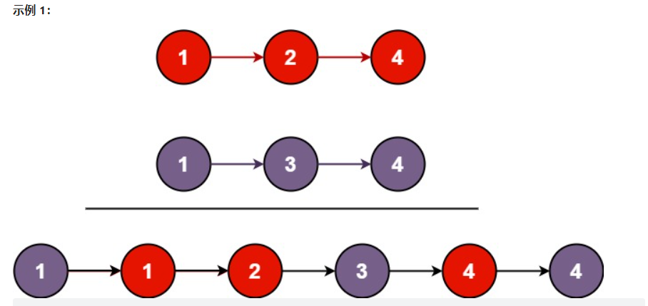
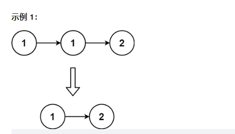
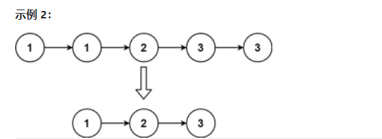
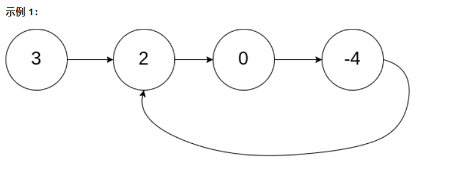
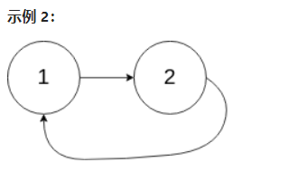

# 链表

## _01_合并两个有序链表 --21
将两个升序链表合并为一个新的 升序 链表并返回。新链表是通过拼接给定的两个链表的所有节点组成的。

 

示例 1：
 

输入：l1 = [1,2,4], l2 = [1,3,4]
输出：[1,1,2,3,4,4]

示例 2：

输入：l1 = [], l2 = []
输出：[]

示例 3：

输入：l1 = [], l2 = [0]
输出：[0]

提示：

两个链表的节点数目范围是 [0, 50]
-100 <= Node.val <= 100
l1 和 l2 均按 非递减顺序 排列

## _02_删除排序链表中的重复元素 --83
给定一个已排序的链表的头 head ， 删除所有重复的元素，使每个元素只出现一次 。返回 已排序的链表 。

示例 1：
 

输入：head = [1,1,2]
输出：[1,2]

示例 2：
 

输入：head = [1,1,2,3,3]
输出：[1,2,3]

提示：

链表中节点数目在范围 [0, 300] 内
-100 <= Node.val <= 100
题目数据保证链表已经按升序 排列

## _03_环形链表 --141
给你一个链表的头节点 head ，判断链表中是否有环。

如果链表中有某个节点，可以通过连续跟踪 next 指针再次到达，则链表中存在环。 为了表示给定链表中的环，评测系统内部使用整数 pos 来表示链表尾连接到链表中的位置（索引从 0 开始）。注意：pos 不作为参数进行传递 。仅仅是为了标识链表的实际情况。

如果链表中存在环 ，则返回 true 。 否则，返回 false 。

 

示例 1：
 

输入：head = [3,2,0,-4], pos = 1
输出：true
解释：链表中有一个环，其尾部连接到第二个节点。

示例 2：
 

输入：head = [1,2], pos = 0
输出：true
解释：链表中有一个环，其尾部连接到第一个节点。

示例 3：
 

输入：head = [1], pos = -1
输出：false
解释：链表中没有环。

提示：

链表中节点的数目范围是 [0, 104]
-105 <= Node.val <= 105
pos 为 -1 或者链表中的一个 有效索引 。

进阶：你能用 O(1)（即，常量）内存解决此问题吗？
