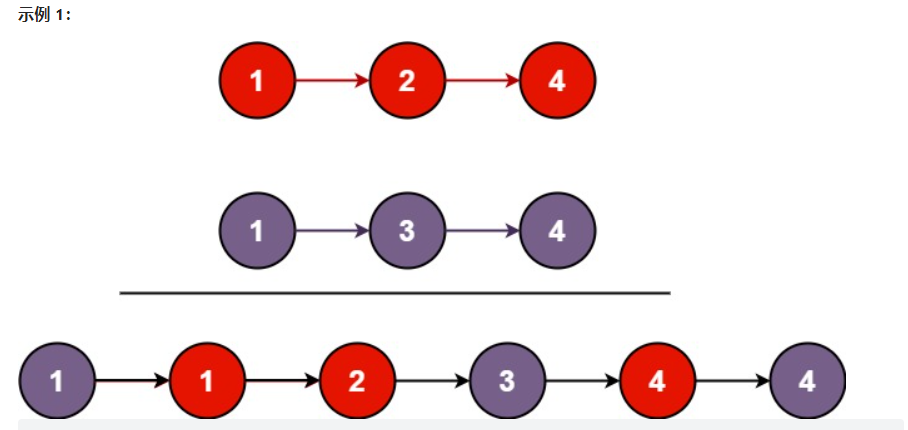
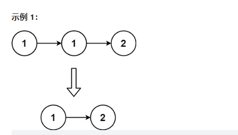
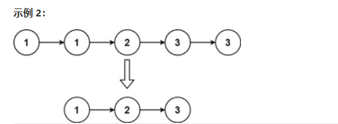

# 链表

## _01_合并两个有序链表 --21
将两个升序链表合并为一个新的 升序 链表并返回。新链表是通过拼接给定的两个链表的所有节点组成的。

 

示例 1：
 

输入：l1 = [1,2,4], l2 = [1,3,4]
输出：[1,1,2,3,4,4]

示例 2：

输入：l1 = [], l2 = []
输出：[]

示例 3：

输入：l1 = [], l2 = [0]
输出：[0]

提示：

两个链表的节点数目范围是 [0, 50]
-100 <= Node.val <= 100
l1 和 l2 均按 非递减顺序 排列

## _02_删除排序链表中的重复元素 --83
给定一个已排序的链表的头 head ， 删除所有重复的元素，使每个元素只出现一次 。返回 已排序的链表 。

示例 1：
 

输入：head = [1,1,2]
输出：[1,2]

示例 2：
 

输入：head = [1,1,2,3,3]
输出：[1,2,3]

提示：

链表中节点数目在范围 [0, 300] 内
-100 <= Node.val <= 100
题目数据保证链表已经按升序 排列
